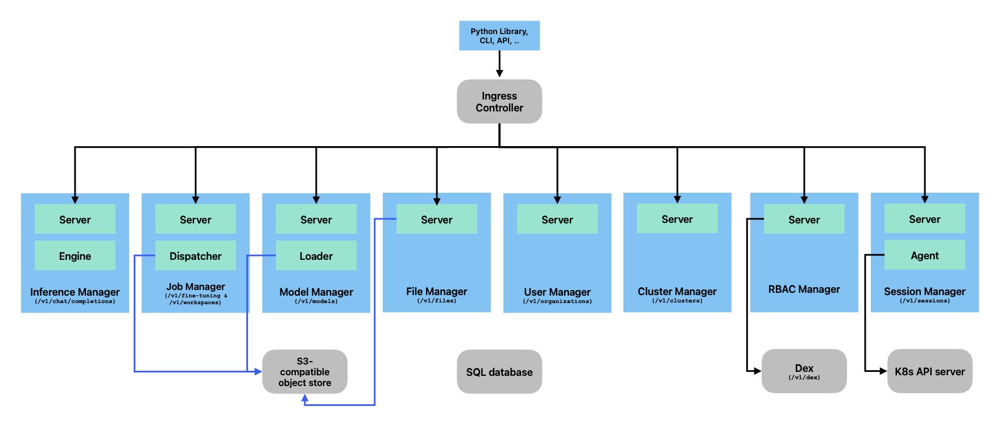

Architecture
============

.. note::

   Work-in-progress.

Components
----------

LLM Operator provisions the LLM stack consisting of the following micro services:

- Inference Manager
- Job Manager
- Model Manager
- File Manager
- User Manager
- Cluster Manager
- Session Manager
- RBAC Manager

Each manager is responsible for the specific feature of LLM services as their names indicate. The following diagram shows the high-level
architecture:

LLM Operator has dependency to the following components:

- Ingress controller
- SQL database
- S3-compatible object store
- `Dex <https://github.com/dexidp/dex>`_

Ingress controller is required to route traffic to each service. SQL database and S3-compatible object store
are used to persist metadata (e.g., fine-tuning jobs), fine-tuned models, and training/validation files.
Dex is to used to provide authentication.

Key Technologies
----------------

Quota Management for Fine-tuning Jobs
^^^^^^^^^^^^^^^^^^^^^^^^^^^^^^^^^^^^^

LLM Operator allows uses to manage GPU quotas with integration with `Kueue <https://github.com/kubernetes-sigs/kueue>`_.

Autoscaling and Dynamic Model Loading/offloading in Inference
^^^^^^^^^^^^^^^^^^^^^^^^^^^^^^^^^^^^^^^^^^^^^^^^^^^^^^^^^^^^^

Inference Manager dynamically loads and offloads models up on requests it receives. It also dynamically auto-scales
pods based on demand.

Session Manager: Secure Access to Kubernetes API Server
^^^^^^^^^^^^^^^^^^^^^^^^^^^^^^^^^^^^^^^^^^^^^^^^^^^^^^^

LLM Operator internally accesses Kubernetes API server to allow end
users to access logs of fine-tuning jobs, exec into a Jupyter
Notebook, etc. As end users might not have direct access to a Kubernetes API server,
LLM Operator uses Session Manager to provide a secure tunnel between end users and Kubernetes API server.

Session Manager consists of two components: `server` and `agent`. The `agent` establishes HTTP(S) connections
to the `server` and keeps the connections. Upon receiving a request from end users, the `server` forwards the request
to the `agent` using one of the established connections. Then the `agent` forwards the request to the Kubernetes API server.

This architecture enables the deployment where the `server` and the `agent` can run in separate Kubernetes clusters. As
the `agent` initiates a connection (not the `server`), there is no need to open incoming traffic at the cluster where the `agent` runs.
An ingress controller is still the only place where incoming traffic is sent.

Multi-Cluster Deployment
------------------------

LLM Operator deploys Kubernetes deployments to provision the LLM
stack. In a typical configuration, all the services are deployed into
a single Kubernetes cluster, but you can also deploy these services on
multiple Kubernetes clusters. For example, you can deploy a control
plane component in a CPU K8s cluster and deploy the rest of the
components in GPU compute clusters.
