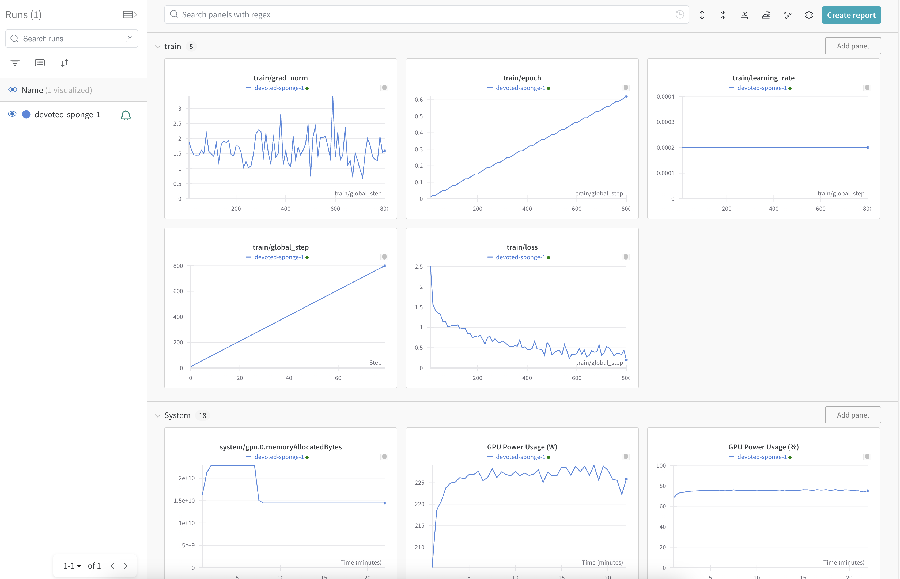
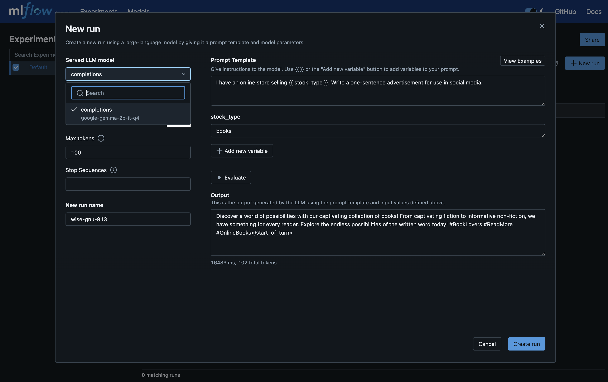

Integrations
============

Weights and Biases (W&B)
------------------------

`Weights and Biases (W&B) <https://wandb.ai/>`_ is an AI developer platform. LLM Operator provides the integration with W&B
so that metrics for fine-tuning jobs are reported to W&B. With the integration, you can easily see the progress of your
fine-tuning jobs, such as training epoch, loss, etc.

Please take the following steps to enable the integration.

First, obtain the API key of W&B and create a Kubernetes secret.

.. code-block:: console

   kubectl create secret generic wandb
     -n <fine-tuning job namespace> \
     --from-literal=apiKey=${WANDB_API_KEY}

The secret needs to be created in a namespace where fine-tuning jobs run. Individual projects specify namespaces for fine-tuning jobs,
and the default project runs fine-tuning jobs in the "default" namespace.

Then you can enable the integration by adding the following to your Helm ``values.yaml`` and re-deploying LLM Operator.

.. code-block:: yaml

   job-manager-dispatcher:
     job:
       wandbApiKeySecret:
         name: wandb
         key: apiKey

A fine-tuning job will report to W&B when the ``integration`` parameter is specified.

.. code-block:: python

   job = client.fine_tuning.jobs.create(
     model="google-gemma-2b-it",
     suffix="fine-tuning",
     training_file=tfile.id,
     validation_file=vfile.id,
     integrations=[
       {
         "type": "wandb",
         "wandb": {
            "project": "my-test-project",
         },
       },
     ],
   )

Here is an example screenshot. You can see metrics like ``train/loss`` in the W&B dashboard.

.. note::

   The W&B API key is attached to fine-tuning jobs as an environment variable. Please be careful of its visibility.

MLflow
------

`MLflow <https://mlflow.org/>`_ is an open-source tool for managing the machine learning lifecycle. It
has various features for LLMs (`link <https://mlflow.org/docs/latest/llms/index.html>`_) and integration
with OpenAI. We can apply these MLflow features to the LLM endpoints provided by LLM Operator.

For example, you can deploy a `MLflow Deployments Server for LLMs <https://mlflow.org/docs/latest/llms/index.html#id1>`_
and use `Prompt Engineering UI <https://mlflow.org/docs/latest/llms/index.html#id3>`_.

Deploying MLflow Tracking Server
^^^^^^^^^^^^^^^^^^^^^^^^^^^^^^^^

Bitmani provides a `Helm chart <https://github.com/bitnami/charts/tree/main/bitnami/mlflow>`_ for MLflow.

.. code-block:: console

   helm upgrade \
     --install \
     --create-namespace \
     -n mlflow \
     mlflow oci://registry-1.docker.io/bitnamicharts/mlflow \
     -f values.yaml

An example ``values.yaml`` is following:

.. code-block:: yaml

   tracking:
     extraEnvVars:
     - name: MLFLOW_DEPLOYMENTS_TARGET
       value: http://deployment-server:7000

We set ``MLFLOW_DEPLOYMENTS_TARGET`` to the address of a MLflow Deployments Server that we will deploy
in the next section.

Once deployed, you can set up port-forwarding and access http://localhost:9000.

.. code-block:: console

   kubectl port-forward -n mlflow service/mlflow-tracking 9000:80

The login credentials are obtained by the following commands:

.. code-block:: console

   # User
   kubectl get secret --namespace mlflow mlflow-tracking -o jsonpath="{ .data.admin-user }" | base64 -d
   # Password
   kubectl get secret --namespace mlflow mlflow-tracking -o jsonpath="{.data.admin-password }" | base64 -d

Deploying MLflow Deployments Server for LLMs
^^^^^^^^^^^^^^^^^^^^^^^^^^^^^^^^^^^^^^^^^^^^

We have an example K8s YAML for deploying a MLflow deployments server `here <https://raw.githubusercontent.com/llm-operator/llm-operator/main/hack/mlflow/deployment-server.yaml>`_.

You can save it locally, up ``openai_api_base`` in the ``ConfigMap`` definition based on your ingress controller address, and then run:

.. code-block:: console

   kubectl create secret generic -n mlflow llm-operator-api-key \
     --from-literal=secret=<Your API key>

   kubectl apply -n mlflow -f deployment-server.yaml

You can then access the MLflow Tracking Server, click "New run", and choose "using Prompt Engineering".

Other Features
^^^^^^^^^^^^^^

Please visit `MLflow page for more information <https://mlflow.org/docs/latest/llms/>`_ for other LLM related features
provided by MLflow.
