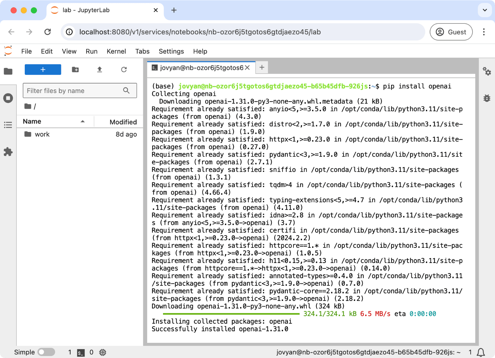
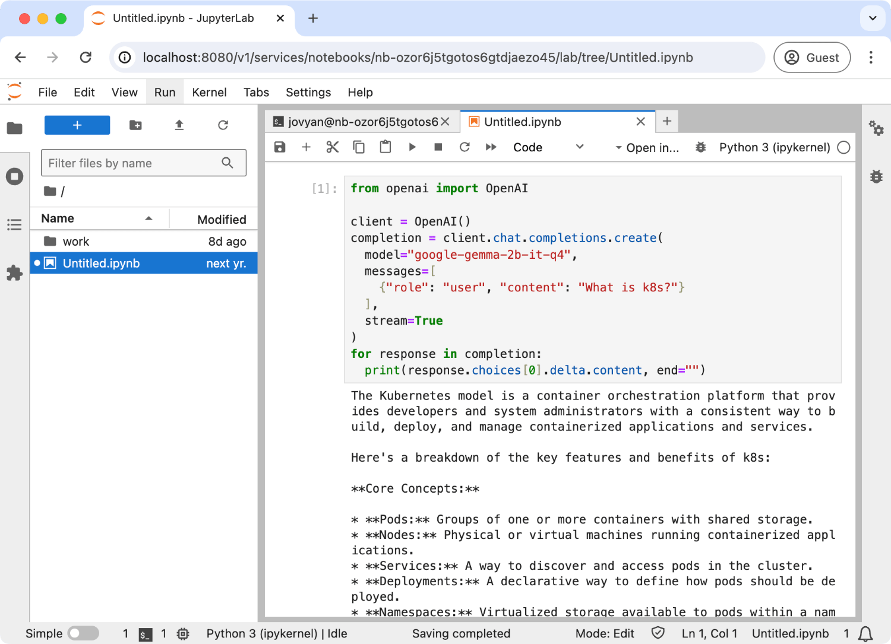

Jupyter Notebook
================

LLM Operator allows users to run a Jupyter Notebook in a Kubernetes cluster. This functionality
is useful when users want to run ad-hoc Python scripts that requires GPU.

Creating a Jupyter Notebook
---------------------------

To create a Jupyter Notebook, run:

.. code-block:: console

   llmo workspace notebooks create my-notebook

By default, there is no GPU is allocated to the Jupyter Notebook.
If you want to allocate a GPU to the Jupyter Notebook, run:

.. code-block:: console

   llmo workspace notebooks create my-gpu-notebook --gpu 1

There are other options that you can specify when creating a Jupyter Notebook, such as environment.
You can see the list of options by using the `--help` flag.

Once the Jupyter Notebook is created, you can access it by running:

.. code-block:: console

   # Open the Jupyter Notebook in your browser
   llmo workspace notebooks open my-notebook

Stopping and Restarting a Jupyter Notebook
------------------------------------------

To stop a Jupyter Notebook, run:

.. code-block:: console

   llmo workspace notebooks stop my-notebook

To restart a Jupyter Notebook, run:

.. code-block:: console

   llmo workspace notebooks start my-notebook

You can check the current status of the Jupyter Notebook by running:

.. code-block:: console

   llmo workspace notebooks list
   llmo workspace notebooks get my-notebook

OpenAI API Integration
----------------------

Jupyter Notebook can be integrated with OpenAI API. Created Jupyter Notebook is pre-configured with OpenAI API URL and API key.
All you need to do is to install the `openai` package.

To install `openai` package, run the following command in the Jupyter Notebook terminal:

.. code-block:: console

   pip install openai

Now, you can use OpenAI API in the Jupyter Notebook. Here is an example of using OpenAI API in the Jupyter Notebook:

.. code-block:: python

   from openai import OpenAI

   client = OpenAI()
   completion = client.chat.completions.create(
     model="google-gemma-2b-it-q4",
     messages=[
       {"role": "user", "content": "What is k8s?"}
     ],
     stream=True
   )
   for response in completion:
     print(response.choices[0].delta.content, end="")
   print("\n")

.. note::

   By default, pre-configured API key is a JWT and it can expire. You can also pass your API key to the `OpenAI` client.
