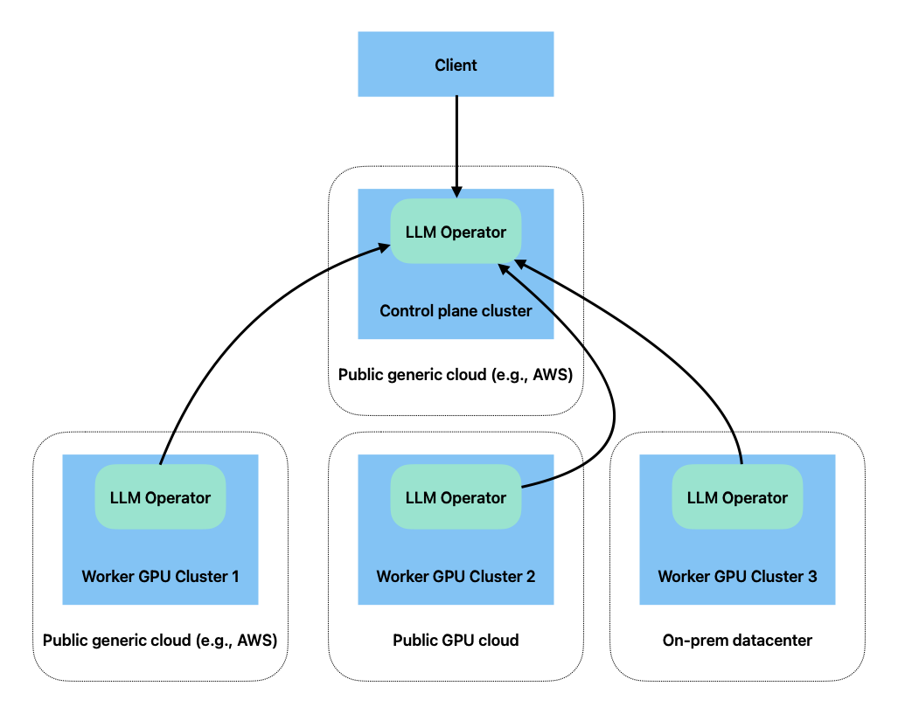

Multi-Cluster and Multi-Cloud Deployment
========================================

LLM Operator deploys Kubernetes deployments to provision the LLM
stack. In a typical configuration, all the services are deployed into
a single Kubernetes cluster, but you can also deploy these services on
multiple Kubernetes clusters. For example, you can deploy a control
plane component in a CPU K8s cluster and deploy the rest of the
components in GPU compute clusters.

LLM Operator can be deployed into multiple GPU clusters, and the clusters can span across multiple cloud providers (including
GPU specific cloud like CoreWeave) and on-prem.

Deploying Control Plane Components
----------------------------------

You can deploy only Control Plane components by setting ``tags.worker=false``:

.. code-block:: console

   helm upgrade \
     --install \
     --create-namespace \
     --namespace <namespace> \
     llm-operator \
     oci://public.ecr.aws/cloudnatix/llm-operator-charts/llm-operator \
     --values <values.yaml> \
     --set tags.worker=false

In the ``values.yaml``, you need to set ``global.workerServiceIngress.create`` to ``true`` and other values so that
an ingress and a service are created to receive requests from worker nodes.

Here is an example ``values.yaml``.

.. code-block:: yaml

   global:
     ingress:
       ingressClassName: kong
       controllerUrl: https://api.mydomain.com
       annotations:
         cert-manager.io/cluster-issuer: letsencrypt
         konghq.com/response-buffering: "false"
       # Enable TLS for the ingresses.
       tls:
         hosts:
         - api.llm.mydomain.com
         secretName: api-tls
     # Create ingress for gRPC requests coming from worker clusters.
     workerServiceIngress:
       create: true
       annotations:
         cert-manager.io/cluster-issuer: letsencrypt
         konghq.com/protocols: grpc,grpcs
     workerServiceGrpcService:
       annotations:
         konghq.com/protocol: grpc

   # Create a separate load balancer for gRPC streaming requests from inference-manager-engine.
   inference-manager-server:
     workerServiceTls:
       enable: true
       secretName: inference-cert
     workerServiceGrpcService:
       type: LoadBalancer
       port: 443
       annotations:
         external-dns.alpha.kubernetes.io/hostname: inference.llm.mydomain.com

   # Create a separate load balancer for HTTPS requests from session-manager-agent.
   session-manager-server:
     workerServiceTls:
       enable: true
       secretName: session-cert
     workerServiceHttpService:
       type: LoadBalancer
       port: 443
       externalTrafficPolicy: Local
       annotations:
         service.beta.kubernetes.io/aws-load-balancer-type: "nlb"
         external-dns.alpha.kubernetes.io/hostname: session.llm.mydomain.com

Deploying Worker Components
---------------------------

To deploy LLM Operator to a worker GPU cluster, you first need to obtain a registration key for the cluster.

.. code-block:: console

   llmo admin clusters register <cluster-name>

The following is an example command that sets the registration key to the environment variable.

.. code-block:: console

   REGISTRATION_KEY=$(llmo admin clusters register <cluster-name> | sed -n 's/.*Registration Key: "\([^"]*\)".*/\1/p')

The command generates a new registration key.

Then you need to make LLM Operator worker components to use the registration key
when making gRPC calls to the control plane.

To make that happen, you first need to create a K8s secret.

.. code-block:: console

   REGISTRATION_KEY=clusterkey-...

   kubectl create secret generic \
     -n llm-operator \
     cluster-registration-key \
     --from-literal=regKey="${REGISTRATION_KEY}"

The secret needs to be created in a namespace where LLM Operator will be deployed.

When installing the Helm chart for the worker components, you need to specify addition configurations in ``values.yaml``.
Here is an example.

.. code-block:: yaml

   global:
     worker:
       controlPlaneAddr: api.llm.mydomain.com:443
       tls:
         enable: true
       registrationKeySecret:
         name: cluster-registration-key
         key: regKey

   inference-manager-engine:
     inferenceManagerServerWorkerServiceAddr: inference.llm.mydomain.com:443

   job-manager-dispatcher:
     notebook:
       llmOperatorBaseUrl: https://api.llm.mydomain.com/v1

   session-manager-agent:
     sessionManagerServerWorkerServiceAddr: session.llm.mydomain.com:443

``tags.control-plane=false`` also needs to be set:

.. code-block:: console

   helm upgrade \
     --install \
     --create-namespace \
     --namespace <namespace> \
     llm-operator \
     oci://public.ecr.aws/cloudnatix/llm-operator-charts/llm-operator \
     --values <values.yaml> \
     --set tags.control-plane=false

Please see `this GitHub repository <https://github.com/llm-operator/llm-operator/tree/main/hack/multi-cluster>`_ for an example setup.
